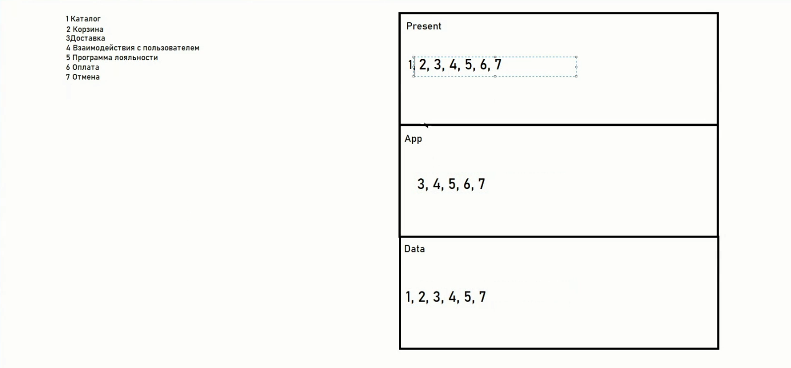
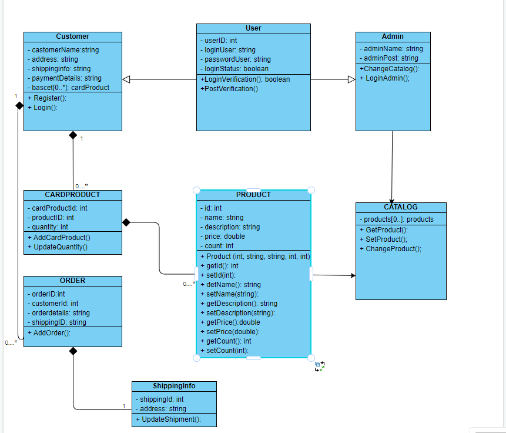

> **СЕМИНАР 5. Горизонтальные уровни и вертикальные срезы архитектуры**

> Домашнее задание: Сформировать компоненты для любой системы из задания. Выпустить диаграмму компонент UML.

> Схема маркетплейса, предложенная на семинаре:

> Итоговая UML - диаграмма:

